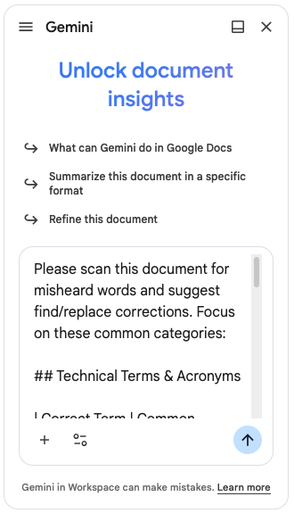
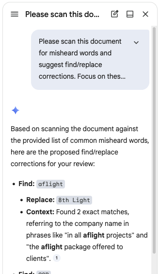
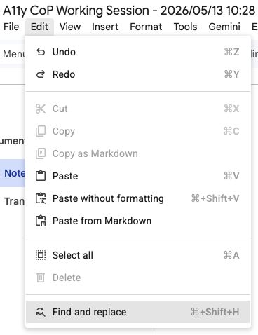
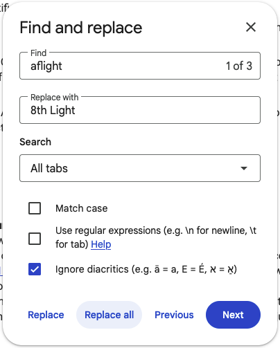
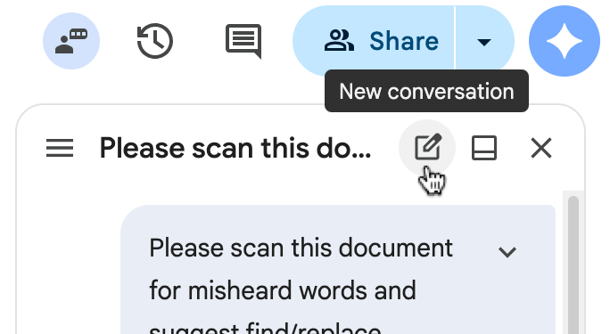

# CoP Scribe Workflow

This guide documents the step-by-step workflow for transforming AI-generated CoP meeting transcripts into vault-ready artifacts. The workflow typically takes 20-30 minutes per session.

**Key locations:**
- **Source:** [CoP Shared Drive](https://drive.google.com/drive/folders/0AM6hUKtSmPmgUk9PVA) → A11y Community of Practice → Session Transcripts
- **Destination:** a11y-cop repository → `sessions/` directory

---

## Step 1: Open the Meeting Notes from Calendar

**Goal:** Access the auto-generated Google Doc from the calendar event.

1. **Open Google Calendar** and navigate to the day of the CoP working session

2. **Click on the "A11y CoP Working Session" event** to open the event details

3. **Click on the attached Google Drive document** labeled with the meeting notes

   

4. **The document opens** in a new tab with the Gemini-generated transcript

---

## Step 2: Move File to Session Transcripts Folder

**Goal:** Organize the transcript in the correct shared drive location.

**Why:** Gemini creates the document in the calendar event's default location. For organization and discoverability, all session transcripts should live in the Session Transcripts folder.

1. **In the open Google Doc, click the folder icon** in the top toolbar (or use File → Move)

   

2. **Navigate to:** A11y Community of Practice → Session Transcripts

3. **Click "Move" to confirm** the new location

   

4. **Confirm ownership change** if prompted (changing from calendar event owner to shared drive)

   

5. **Verify the move succeeded** - you'll see a confirmation toast

   

---

## Step 3: Validation

**Goal:** Correct errors and inaccuracies in the AI-generated transcript.

**Tool:** Gemini (in Google Docs)

**Steps:**

1. **Run Gemini validation** to find and fix misheard words:
   
   a. Open Gemini sidebar in Google Docs
   
   b. Open [prompts/gemini-mishears-prompt.md](prompts/gemini-mishears-prompt.md) in this repository
   
   c. Copy the entire prompt and paste it into Gemini
   
   
   
   d. Review Gemini's scan results and flagged mishears
   
   
   
   e. Use Edit → Find and Replace to apply corrections
   
   
   
   f. Enter the misheard term and correct replacement in the Find and Replace dialog
   
   
   
   g. Review each occurrence and apply replacements appropriately
   
   h. **Iterate until no new valid results:** Start a new Gemini conversation and repeat from step (c)
   
   
   
   - Continue until Gemini returns no new valid mishears
   - **Important:** Gemini may hallucinate mishears or search other documents. Always verify suggestions using Find and Replace - if the term isn't found in the document, it's a false positive. This vetting step is why the scribe is essential.

2. **Verify speaker names:**
   - Check that all speaker names are consistent throughout
   - Correct any name misspellings
   - Match names to known CoP members

3. **Validate action items:**
   - Ensure action items match what was actually committed to verbally
   - Verify owners are correctly assigned
   - Add missing context if needed

---

## Step 4: Curation

**Goal:** Make content selection decisions for repository commit.

**Tool:** Manual review in Google Docs

**Steps:**

1. **Check for confidential content:**
   
   
   
   *Start a fresh conversation - do not continue from the validation prompt*
   
   a. Open Gemini sidebar in Google Docs
   
   b. Open [prompts/gemini-redaction-prompt.md](prompts/gemini-redaction-prompt.md) in this repository
   
   c. Copy the entire prompt and paste it into Gemini
   
   d. Review Gemini's flagged items (client names, PII, internal metrics, sensitive project details)
   
   e. Apply redactions by replacing with generic placeholders or removing content
   
   f. **Iterate until no new valid results:** Start a new Gemini conversation and repeat from step (c)
   
   - Continue until Gemini returns no new confidential content
   - **Important:** Gemini may flag false positives or search other documents. Always verify flagged content is actually present and needs redaction. This vetting step is why the scribe is essential.

---

## Step 5: Final Scan for Missed Items

**Goal:** Catch any mishears or confidential content not covered by the standard validation and redaction prompts.

**Tool:** Gemini (in Google Docs)

**Steps:**


*Start a fresh conversation - do not continue from the redaction prompt*

1. **Open a new Gemini conversation**

2. **Open [prompts/gemini-missing-items-prompt.md](prompts/gemini-missing-items-prompt.md)** in this repository

3. **Copy the entire prompt and paste it into Gemini**

4. **Review Gemini's flagged items** with fresh eyes:
   - Potential mishears not in the standard table (technical jargon, malformed acronyms, company/product names)
   - Potential confidential content not in the standard table (implicit client references, internal process details)

5. **Apply corrections or redactions as needed**

6. **Document every missed item found:**
   
   **CRITICAL:** Keep a record of each item that was missed by the previous prompts. For each item, document:
   
   - **What it is:** The correct term/name/content
   - **How it appeared in the transcript:** The misheard version or how confidential content was expressed
   - **How to find it:** Search terms or patterns that would catch it
   - **How to fix it:** The correct replacement or redaction strategy
   
   **Example format:**
   ```
   Missed Item: Axe DevTools
   Appeared as: "access dev tools"
   Search pattern: "access dev tools"
   Fix: Replace with "Axe DevTools"
   Type: Mishear (product name)
   ```
   
   **Why this matters:** These documented items will be added to the standard prompts so future scribes don't miss the same things. This creates a continuous improvement loop.
   
   Save your findings to include in your PR (see Step 6 for PR requirements).

**Context:** By this point, all items from the standard tables should be fixed (from Steps 3 and 4), so Gemini can focus on finding NEW issues.

---

## Step 6: Transformation

**Goal:** Convert to vault markdown with proper structure and frontmatter.

**Tool:** Google Docs export + manual markdown editing

**Steps:**

1. **Export ONLY the Notes tab** from Google Docs:
   - While on the Notes tab
   - File → Download → Markdown (.md)
   
     
   
   - In the export dialog, for Tab **select "Current Tab"**
   
     
   
   - Click Export
   - Save to your local machine

2. **Format and save the notes** using Claude Code:
   
   In Claude Code, run the `/prepare-cop-notes` skill with the path to your exported file:
   
   ```
   /prepare-cop-notes ~/Downloads/Meeting notes - YYYY-MM-DD.md
   ```
   
   The skill will:
   - Remove transcript section (if accidentally included in export)
   - Remove timestamp references (e.g., `([00:05:12](#00:05:12))`)
   - Extract the session date and attendee names from the document
   - Add the required frontmatter
   - Save to `a11y-cop/sessions/YYYY-MM-DD-session-notes.md`

---

## Step 7: Commit and Create Pull Request

**Goal:** Version the transcript and request review.

**Tool:** Git and GitHub

**Steps:**

1. **Create git branch and commit:**
   
   **Optional automation:** Invoke the `/using-git` skill in Claude Code to either automate this process for you or generate copy/paste strings for each command.
   
   If you prefer to run the commands manually, ensure you are in the root of the a11y-cop repository:
   
   ```bash
   git checkout -b transcript/YYYY-MM-DD-cop-session
   git add sessions/YYYY-MM-DD-session-notes.md
   git commit -m "docs(sessions): add YYYY-MM-DD session transcript"
   git push origin transcript/YYYY-MM-DD-cop-session
   ```

2. **Create pull request:**
   
   When you create the PR on GitHub, the session transcript template will automatically load. Fill in:
   
   - **Title:** "Add YYYY-MM-DD CoP session transcript"
   - **Session Summary:** 2-3 sentence overview
   - **Topics Covered:** Bullet list of main discussion points
   - **Decisions Made:** Action items or decisions from the session
   - **Missed Items:** Document any mishears or confidential content caught in Step 5 that weren't in the standard prompts (this creates the continuous improvement loop)
   - **Scribe Checklist:** Confirm all steps completed
   
   Request review from another CoP member.

---

## Step 8: Retrospective and Workflow Improvement

**Goal:** Capture learnings and improve the workflow for future scribes.

**Tool:** Claude Code skills

**Steps:**

1. **Run the scribe-retrospective skill:**
   
   In Claude Code, invoke:
   
   ```
   /scribe-retrospective
   ```
   
   The skill will:
   - Ask you to provide the findings from Step 5 (missed mishears, missed confidential content, prompt issues)
   - Analyze these findings and map them to specific workflow improvements
   - Suggest updates to the Gemini prompts, find/replace tables, or workflow steps
   - Add these improvements to your PR alongside the session transcript

2. **Optionally run the workflow-feedback skill:**
   
   If you encountered other friction during the scribe process (confusing steps, unclear instructions, tedious manual work), invoke:
   
   ```
   /workflow-feedback
   ```
   
   The skill will:
   - Collect feedback about what slowed you down or caused confusion
   - Identify opportunities to automate or clarify workflow steps
   - Document these improvements in your PR

**Why this matters:** Each scribe session makes the workflow better for the next person. Documenting missed items creates a continuous improvement loop.

---

## Verification Checklist

Before marking your scribe work complete:

- [ ] All eight steps completed (Calendar access, File organization, Validation, Curation, Final scan, Transformation, Commit and PR, Retrospective)
- [ ] Speaker names consistent and correct
- [ ] ASR mishears corrected (8th Light, WCAG, axe, etc.)
- [ ] No confidential content in vault version
- [ ] Notes tab exported (not full transcript)
- [ ] Frontmatter added with correct date and attendees
- [ ] File named correctly: `YYYY-MM-DD-session-notes.md`
- [ ] Committed to branch and PR created
- [ ] Full transcript remains on CoP Shared Drive for reference

---

## Resources

- **CoP Shared Drive:** [A11y Community of Practice](https://drive.google.com/drive/folders/0AM6hUKtSmPmgUk9PVA)
- **Repository:** [github.com/8thlight/a11y-cop](https://github.com/8thlight/a11y-cop)
- **CoP Charter:** `charter/8L-A11y-CoP-Charter.md` in this repo
- **Questions?** Ask in #a11y-community-of-practice Slack channel
