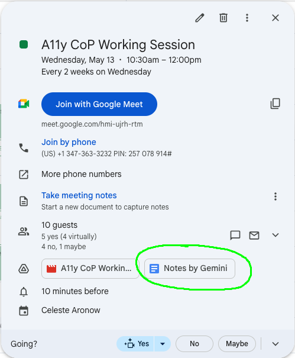
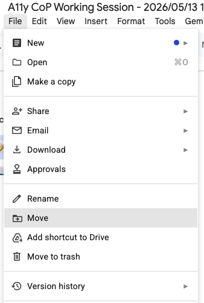
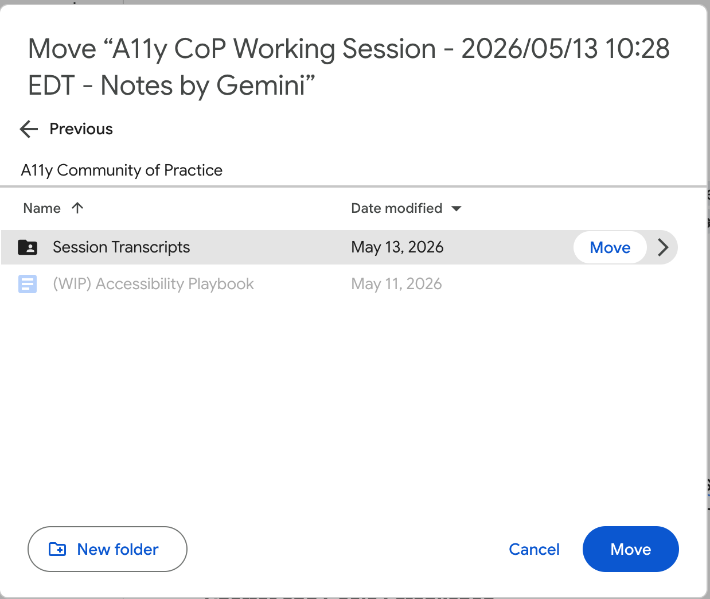
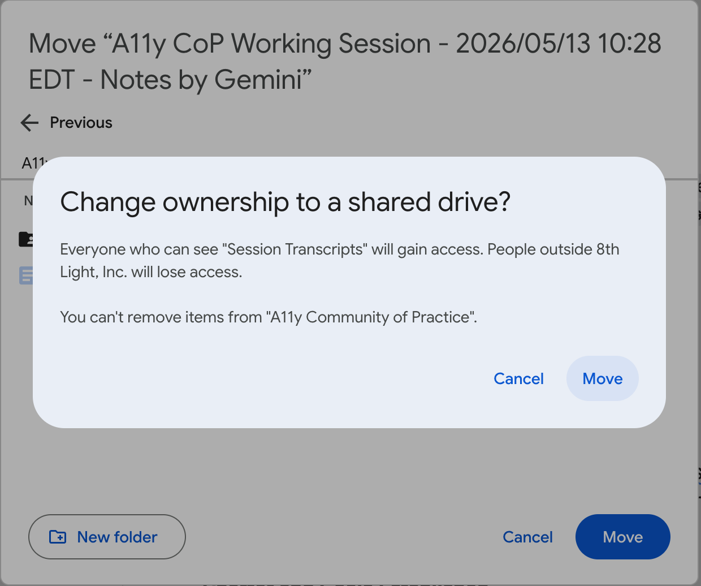
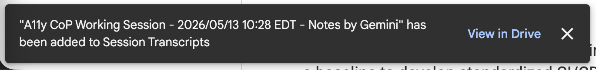
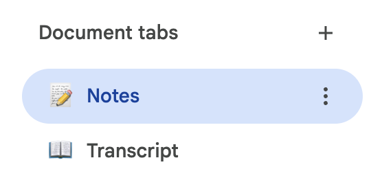
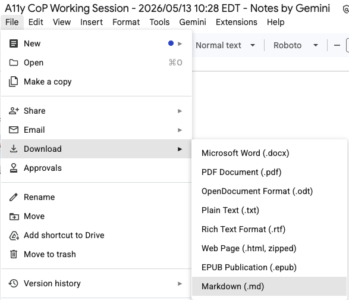
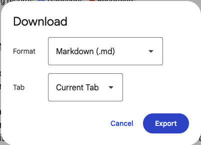

# CoP Scribe Workflow

This guide documents the step-by-step workflow for transforming AI-generated CoP meeting notes into vault-ready artifacts. The workflow typically takes 20-30 minutes per session.

**The fastest way to run this workflow:** open Claude Code and run:

```
/scribe-workflow
```

It will guide you through all steps interactively. The rest of this document is a manual reference if you need it.

---

> **Notes tab only.** Google Meet creates two document tabs after a session: **Notes** (Gemini's auto-generated summary, 2-5 pages) and **Transcript** (verbatim record, 40+ pages). Work only on the Notes tab. Do not open or touch the Transcript tab.

**Key locations:**
- **Source:** [CoP Shared Drive](https://drive.google.com/drive/folders/0AM6hUKtSmPmgUk9PVA) → A11y Community of Practice → Session Transcripts
- **Destination:** a11y-cop repository → `sessions/` directory

---

## Step 1: Open and Move Gemini Notes

**Goal:** Access the auto-generated Google Doc from the calendar event and move it to the shared CoP drive.

**Why:** Gemini creates the document in the calendar event owner's personal Drive. Moving it to the shared Session Transcripts folder makes it accessible to all CoP members.

1. **Open Google Calendar** and navigate to the day of the CoP working session

2. **Click on the "A11y CoP Working Session" event** to open the event details

3. **Click on the attached Google Drive document** labeled with the meeting notes

   

4. **The document opens** in a new tab with two tabs: Notes and Transcript. Navigate to the **Notes tab** — this is the only tab you will work with.

5. **Click the folder icon** in the toolbar (or use File → Move)

   

6. **Navigate to:** A11y Community of Practice → Session Transcripts

7. **Click "Move" to confirm** the new location

   

8. **Confirm ownership change** if prompted (changing from calendar event owner to shared drive)

   

9. **Verify the move succeeded** — you'll see a confirmation toast on the bottom left of the screen.

   

---

## Step 2: Export Notes Tab

**Goal:** Download the Notes tab as a markdown file for processing.

1. **Make sure you are on the Notes tab** (not the Transcript tab)

   


2. **File → Download → Markdown (.md)**

   

3. **In the export dialog, select "Current Tab"** to export only the Notes tab

   

4. **Click Export** and save to your local machine

---

## Step 3: Transform and Review Notes with Claude Code

**Goal:** Format the exported notes, add frontmatter, and review for issues before committing.

Run `/prepare-cop-notes` with the path to your exported file:

```
/prepare-cop-notes /path/to/your/exported-file.md
```

The filename Google Docs generates varies. Use whatever it was saved as on your machine (e.g. `~/Downloads/A11y\ CoP\ Working\ Session\ -\ 2026_05_27\ 10_29\ EDT\ -\ Notes\ by\ Gemini.md`).

It will:
- Remove transcript section (if accidentally included in export)
- Remove timestamp references — both simple (`([00:05:12](#00:05:12))`) and Google Docs deep-link formats
- Extract the session date and attendee names (non-strikethrough invitees didn't decline but may not have attended — confirm the list)
- Remove Gemini UI artifacts (feedback prompts, survey links, section labels)
- Review content for speaker name inconsistencies, client names, and PII — report all findings before saving
- Add the required frontmatter
- Save to `a11y-cop/sessions/YYYY-MM-DD-session-notes.md`

**Address all flagged items before confirming the save.**

---

## Step 4: Retrospective

**Goal:** Capture anything you fixed manually and update the workflow for future scribes.

Run:

```
/scribe-retrospective
```

The skill will ask what you corrected manually after Claude's review — name spellings, client names, or anything else not caught automatically. If any skill tables need updating, it will apply those changes now.

---

## Step 5: Commit and Create Pull Request

**Goal:** Version the notes and request review.

**If using Claude Code:**
```
/using-git
```

The skill will show you what it found and confirm the commit split before proceeding:
- **Commit 1:** session notes
- **Commit 2:** skill improvements from the retrospective (if any)

**Manually (replace `2026-05-27` with the session date):**
```bash
git checkout -b transcript/2026-05-27-cop-session
git add sessions/2026-05-27-session-notes.md
git commit -m "docs(sessions): add 2026-05-27 session notes"

# If anything changed during the retrospective:
git add .claude/skills/
git commit -m "chore(scribe): apply retro improvements"

git push -u origin transcript/2026-05-27-cop-session
gh pr create --title "Add 2026-05-27 CoP session transcript"
```

When the PR opens on GitHub, the session transcript template loads automatically. Fill in:

- **Title:** "Add YYYY-MM-DD CoP session transcript"
- **Session Summary:** 2-3 sentence overview
- **Topics Covered:** Bullet list of main discussion points
- **Decisions Made:** Action items or decisions from the session
- **Scribe Checklist:** Confirm all steps completed

Request review from another CoP member.

---

## Verification Checklist

Before marking your scribe work complete:

- [ ] All five workflow steps completed (Open and move Gemini notes, Export notes tab, Transform and review, Retrospective, Commit and PR)
- [ ] Retrospective run and any improvements committed
- [ ] Speaker names consistent and correct
- [ ] Client names redacted with bracketed placeholders (e.g., `[Education Client]`)
- [ ] No PII or confidential content in committed file
- [ ] Notes tab exported (not full transcript)
- [ ] Frontmatter added with correct date and attendees
- [ ] File named correctly: `YYYY-MM-DD-session-notes.md`
- [ ] ASR mishears and technical terms verified
- [ ] Committed to branch and PR created
- [ ] Full transcript remains on CoP Shared Drive for reference

---

## Resources

- **CoP Shared Drive:** [A11y Community of Practice](https://drive.google.com/drive/folders/0AM6hUKtSmPmgUk9PVA)
- **Repository:** [github.com/8thlight/a11y-cop](https://github.com/8thlight/a11y-cop)
- **CoP Charter:** `charter/8L-A11y-CoP-Charter.md` in this repo
- **Questions?** Ask in #a11y-community-of-practice Slack channel
